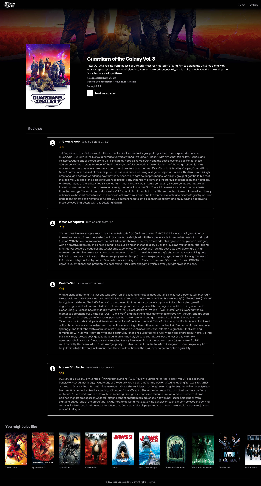
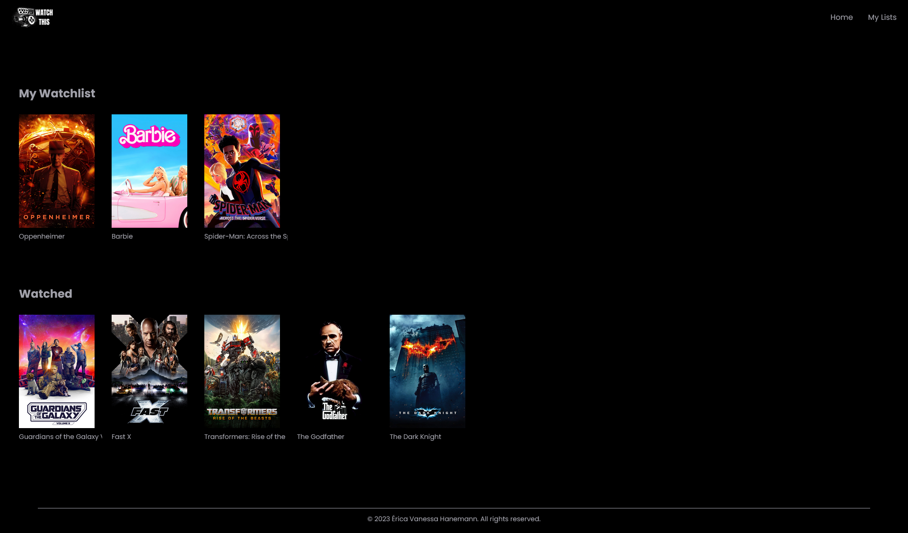

# Watchthis

  Watchthis is an application that connects to The Movie Database API to provide trending, top-rated, and upcoming movie recommendations. You can explore detailed information about each movie and even create your own watchlist. 

  <a href="#layout">Layout</a>&nbsp;&nbsp;&nbsp;|&nbsp;&nbsp;&nbsp;
  <a href="#technologies">Technologies</a>&nbsp;&nbsp;&nbsp;|&nbsp;&nbsp;&nbsp;
  <a href="https://watch-this-app.vercel.app/" target="_blank">Live Demo</a>

## Layout

- Home page

- Movie page

- Lists page

## Technologies

This project was developed using the following technologies and libraries:

- HTML e CSS (Tailwind CSS)
- JavaScript
- NPM
- Axios
- Vite
- React
- React Icons
- React Router
- API The Movie Database
